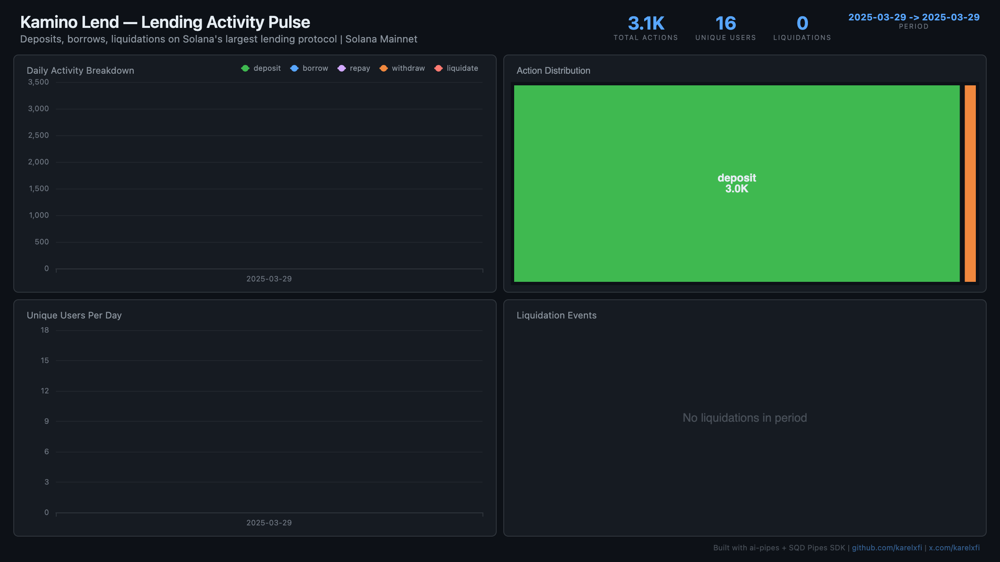

# Kamino Lend — Lending Activity Pulse

> First Solana indexer in the ai-pipes collection. Tracks deposits, borrows, repays, withdrawals, and liquidations on Kamino Lend (KLend), the largest lending protocol on Solana.



## Angle

**Lending Activity Pulse** — Classify every Kamino Lend instruction by type (deposit, borrow, repay, withdraw, liquidate) to reveal protocol usage patterns, growth trajectory, and risk events (liquidation spikes).

## Architecture

- **Chain:** Solana Mainnet
- **Program:** `KLend2g3cP87fffoy8q1mQqGKjrxjC8boSyAYavgmjD`
- **Start slot:** 280,000,000 (~December 2024)
- **Approach:** Custom transformer classifying instructions by Anchor d8 discriminator — no full data decoding needed

## Verification Report

> Not yet run. Execute `npx tsx validate.ts` after syncing data.

## Run Instructions

```bash
# 1. Start ClickHouse
docker compose up -d

# 2. Install dependencies
npm install

# 3. Run the indexer
npm start

# 4. Validate data
npx tsx validate.ts

# 5. Open dashboard
open dashboard/index.html
```

## Sample ClickHouse Queries

```sql
-- Action breakdown
SELECT action, count() as n FROM kamino_actions GROUP BY action ORDER BY n DESC;

-- Daily activity
SELECT toDate(timestamp) as day, action, count() as n
FROM kamino_actions GROUP BY day, action ORDER BY day;

-- Unique users per day
SELECT toDate(timestamp) as day, uniq(fee_payer) as users
FROM kamino_actions GROUP BY day ORDER BY day;

-- Liquidation events
SELECT toDate(timestamp) as day, count() as liquidations
FROM kamino_actions WHERE action = 'liquidate' GROUP BY day ORDER BY day;
```

## Discriminators

| Action | Anchor d8 | Instruction Name |
|--------|-----------|------------------|
| deposit | `0x81c70402de271a2e` | `deposit_reserve_liquidity_and_obligation_collateral` |
| borrow | `0x797f12cc49f5e141` | `borrow_obligation_liquidity` |
| repay | `0x91b20de14cf09348` | `repay_obligation_liquidity` |
| liquidate | `0xb1479abce2854a37` | `liquidate_obligation_and_redeem_reserve_collateral` |
| withdraw | `0x4b5d5ddc2296dac4` | `withdraw_obligation_collateral_and_redeem_reserve_collateral` |
