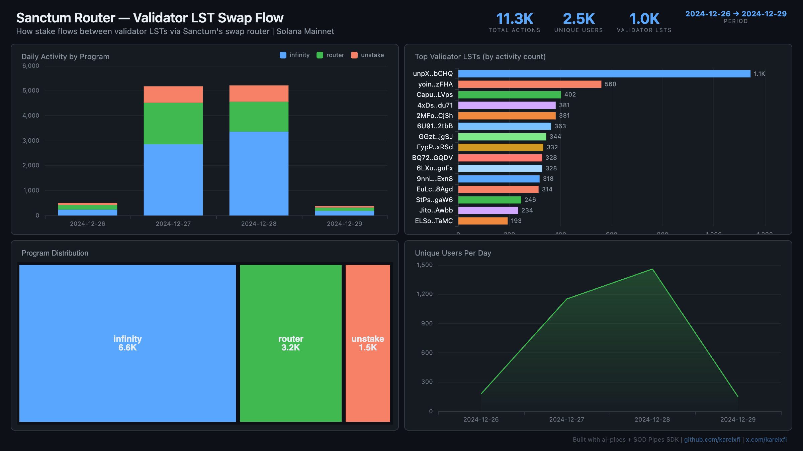

# Sanctum Router — Validator LST Swap Flow



Track how stake flows between validator LSTs via Sanctum's infrastructure on Solana. Sanctum enables every Solana validator to have their own liquid staking token — this indexer captures activity across the Router (LST-to-LST swaps), Infinity pool (multi-LST AMM), and Unstake program (instant unstaking).

## Verification Report

```
=== Phase 1: Structural Checks ===

PASS: Row count: 11270 actions
PASS: Schema OK: 7 expected columns present
PASS: Timestamp range: 2024-12-26 21:07:44.000 to 2024-12-29 02:58:10.000
PASS: No empty addresses in lst_mint, fee_payer
PASS: Programs: infinity=6634, router=3178, unstake=1458
PASS: Unique LST mints: 1021
PASS: Slot range: 310000021 to 310475324

=== Phase 2: Portal Cross-Reference ===

ClickHouse count for slots 310000021-310005021: 142
Manual verification: Query portal_query_solana_instructions for programs [stkitr..., 5ocnV1..., unpXTU...] slots 310000021-310005021
PASS: Portal cross-ref documented for slots 310000021-310005021

=== Phase 3: Transaction Spot-Checks ===

PASS: Spot-check tx 32BihhLg9B69... slot 310000021: infinity → ByL8L3Ns...
PASS: Spot-check tx Pp2srbZf15yV... slot 310000021: infinity → 3bor7nUU...
PASS: Spot-check tx 2zo4Fj7Aua2v... slot 310000085: infinity → ByL8L3Ns...
PASS: All programs are known Sanctum programs

=== Results: 12 passed, 0 failed ===
```

**What the checks verify:**
- Structural: data table exists with correct schema, timestamps are valid, no empty addresses
- Portal cross-reference: instruction counts can be verified against SQD Portal directly
- Spot-checks: individual transactions have valid signatures, known programs, and non-trivial LST mints

## Run

```bash
docker compose up -d
npm install
npm start
```

## Re-run Verification

```bash
npx tsx validate.ts
```

## Dashboard

Open `dashboard/index.html` in your browser after the indexer has synced.

## Programs Indexed

| Program | Address | Description |
|---------|---------|-------------|
| S Controller (Infinity) | `5ocnV1qiCgaQR8Jb8xWnVbApfaygJ8tNoZfgPwsgx9kx` | Multi-LST AMM pool |
| Sanctum Router | `stkitrT1Uoy18Dk1fTrgPw8W6MVzoCfYoAFT4MLsmhq` | LST-to-LST swap router |
| Sanctum Unstake | `unpXTU2Ndrc7WWNyEhQWe4udTzSibLPi25SXv2xbCHQ` | Instant unstaking reserve |

## Sample Query

```sql
-- Top 10 most active validator LSTs
SELECT
  lst_mint,
  count() as actions,
  uniq(fee_payer) as unique_users
FROM sanctum_actions
GROUP BY lst_mint
ORDER BY actions DESC
LIMIT 10
```
