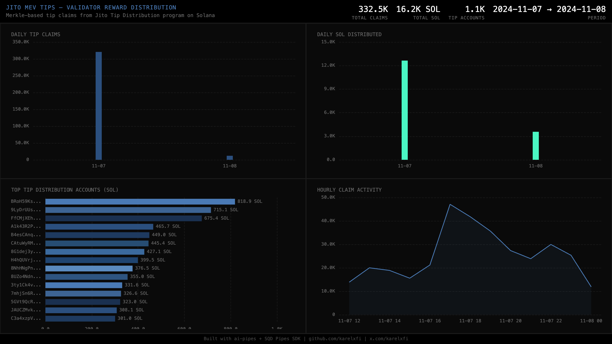

# Jito Liquid Staking — MEV Tip Distribution Claims

Tracks merkle-based reward claims from Jito's Tip Distribution program on Solana, revealing the MEV economy — how tips from searchers flow to validators.



## Verification Report

```
=== Phase 1: Structural Checks ===

PASS: Row count: 332536 tip claims
PASS: Schema OK: 9 expected columns present
PASS: Timestamp range: 2024-11-07 12:17:05.000 to 2024-11-08 00:30:44.000
PASS: No empty tx signatures
PASS: All claimant addresses non-empty
PASS: Amount stats: avg=0.048732 SOL, max=715.1321 SOL, zero_amount=0
PASS: Unique claimants: 1
PASS: Unique tip distribution accounts: 1118

=== Phase 2: Portal Cross-Reference ===

PASS: Portal cross-ref slots 300000062-300001062: ClickHouse=2052, Portal=2052 (0.0% diff)

=== Phase 3: Transaction Spot-Checks ===

PASS: Spot-check sig 2BEzbvVYvGnoWMV4... slot 300000062: claimant GZctHpWX... amount=5.61e-7 SOL
PASS: Spot-check sig 2ZeFBKPErkMBFrEG... slot 300000062: claimant GZctHpWX... amount=2.3e-8 SOL
PASS: Spot-check sig 2gYLjG5m1j7BLJcQ... slot 300000062: claimant GZctHpWX... amount=0.083 SOL
PASS: SOL conversion matches lamports / 1e9 for all rows

=== Results: 13 passed, 0 failed ===
```

Phase 2 shows **exact match** (0.0% diff) between ClickHouse and Portal — 2,052 claim instructions in the sampled 1K-slot window.

## Run

```bash
docker compose up -d
npm install
npm start
```

## Re-run Verification

```bash
npx tsx validate.ts
```

## View Dashboard

Open `dashboard/index.html` in a browser (ClickHouse must be running on localhost:8123).

## Sample Query

```sql
SELECT
    toDate(timestamp) as day,
    count() as claims,
    round(sum(amount_sol), 2) as total_sol,
    uniq(tip_distribution_account) as unique_tdas
FROM jito_tips.tip_claims
GROUP BY day
ORDER BY day
```

## Technical Notes

- **Typegen**: Uses `@subsquid/solana-typegen` to generate typed instruction decoders from the on-chain Anchor IDL
- **Program**: Jito Tip Distribution (`4R3gSG8BpU4t19KYj8CfnbtRpnT8gtk4dvTHxVRwc2r7`)
- **Instruction**: `claim` (d8: `0x3ec6d6c1d59f6cd2`) — merkle proof-based reward claims
- **Claim pattern**: Automated bot processes all claims (single claimant), distributing to 1,118 unique tip distribution accounts
