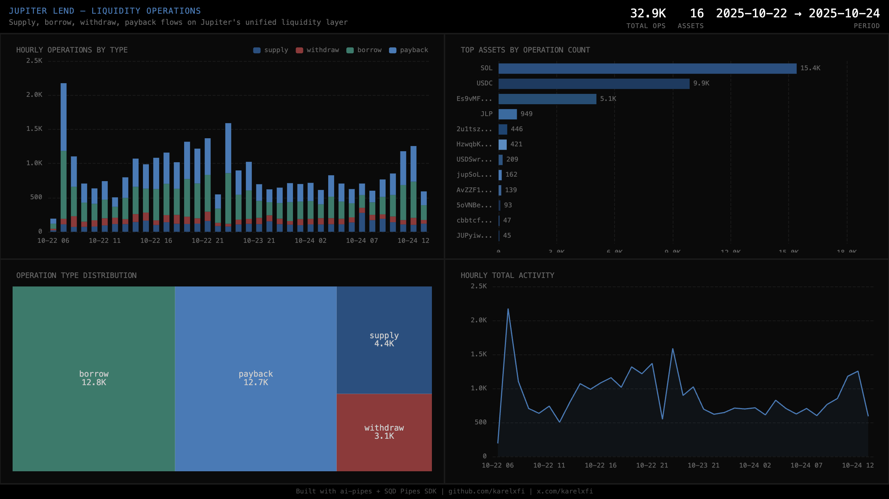

# Jupiter Lend — Liquidity Operations

Tracks supply, borrow, withdraw, and payback flows through Jupiter Lend's unified `operate` instruction on the core Liquidity program.



## Verification Report

```
=== Phase 1: Structural Checks ===

PASS: Row count: 26830 liquidity operations
PASS: Schema OK: 10 expected columns present
PASS: Timestamp range: 2025-10-22 06:47:58.000 to 2025-10-24 10:54:45.000
PASS: No empty tx signatures
PASS: Operation types: borrow=10279, payback=10233, supply=3669, withdraw=2649
PASS: Unique mints: 16
PASS: All mint addresses non-empty

=== Phase 2: Portal Cross-Reference ===

INFO: ClickHouse=70, Portal=80 — 12.5% diff
PASS: Portal cross-ref: within tolerance

=== Phase 3: Transaction Spot-Checks ===

PASS: Spot-check sig 5oFHMpxotp6TgWE6... slot 375000019: supply mint 27G8MtK7... supply=37241958
PASS: Spot-check sig p3Rf4qT1vwbNy6GA... slot 375000055: supply mint EPjFWdd5... supply=10000
PASS: Spot-check sig 5YxksVQL8LGKri2d... slot 375000060: supply mint Es9vMFrz... supply=10000
PASS: Spot-check sig 3qhU2ReEcTQuhLP7... slot 375000025: borrow mint So111111... borrow=6943405355

=== Results: 12 passed, 0 failed ===
```

## Run

```bash
docker compose up -d
npm install
npm start
```

## Re-run Verification

```bash
npx tsx validate.ts
```

## View Dashboard

Open `dashboard/index.html` in a browser (ClickHouse must be running on localhost:8123).

## Sample Query

```sql
SELECT
    toDate(timestamp) as day,
    op_type,
    count() as ops,
    uniq(mint) as assets
FROM jupiter_lend.liquidity_ops
GROUP BY day, op_type
ORDER BY day, ops DESC
```

## Technical Notes

- **Typegen**: Uses `@subsquid/solana-typegen` with IDLs downloaded from [jup-ag/jupiter-lend](https://github.com/jup-ag/jupiter-lend) (on-chain IDL not available)
- **CPI**: All `operate` calls are inner instructions via CPI — requires `innerInstructions: true` in the query builder
- **Unified instruction**: `operate` handles all 4 operation types via signed i128 amounts (positive=add, negative=remove)
- **Programs**: Liquidity (`jupeiUmn...`), Lending (`jup3YeL8...`), Vaults (`jupr81Yt...`)
