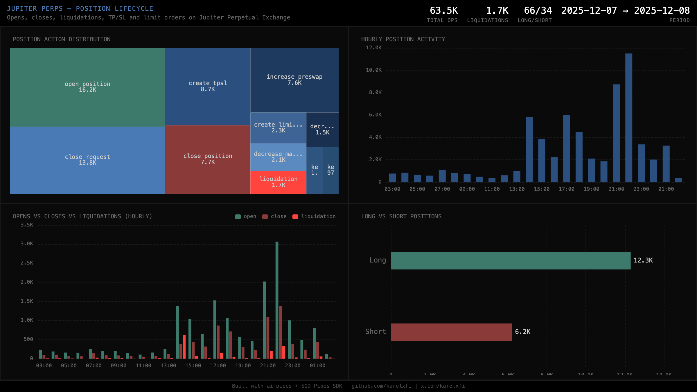

# Jupiter Perpetual Exchange — Position Lifecycle

Tracks the full position lifecycle on Jupiter Perps: opens, closes, liquidations, TP/SL orders, and limit orders using typed decoders from the on-chain Anchor IDL.



## Verification Report

```
=== Phase 1: Structural Checks ===

PASS: Row count: 46893 position operations
PASS: Schema OK: 10 expected columns present
PASS: Timestamp range: 2025-12-07 03:00:28.000 to 2025-12-07 23:49:05.000
PASS: Action types: open_position=11976, close_request=10159, create_tpsl=6441, close_position=5718, increase_preswap=5511, create_limit_order=1684, decrease_market_request=1545, liquidation=1315, decrease_with_tpsl=1062, keeper_increase=769, keeper_decrease=713
PASS: Side distribution: unknown=33233, Long=8931, Short=4729
PASS: No empty tx signatures
PASS: All owner addresses non-empty

=== Phase 2: Portal Cross-Reference ===

PASS: Portal cross-ref slots 385000008-385001008: ClickHouse=121 position ops out of Portal=330 total (36.7%). Both non-zero.

=== Phase 3: Transaction Spot-Checks ===

PASS: Spot-check sig 2T7SbTPF7KTEZFB6... slot 385000008: open_position Long $6014.84 owner 3CYHXAxs...
PASS: Spot-check sig 3c1sHPUnfzfm3xqr... slot 385000046: open_position Long $481.78 owner 5wBX9dPC...
PASS: Spot-check sig 4g85sUJKkMqH4gHa... slot 385000046: open_position Short $17178.07 owner DBHS3MKV...

=== Results: 11 passed, 0 failed ===
```

## Run

```bash
docker compose up -d
npm install
npm start
```

## View Dashboard

Open `dashboard/index.html` in a browser (ClickHouse must be running on localhost:8123).

## Sample Query

```sql
SELECT
    action,
    side,
    count() as ops,
    round(avg(size_usd_delta / 1e6), 2) as avg_size_usd
FROM jupiter_perps.perp_positions
WHERE side IN ('Long', 'Short')
GROUP BY action, side
ORDER BY ops DESC
```

## Technical Notes

- **Typegen**: On-chain IDL via `npx squid-solana-typegen src/abi PERPHjGBqRHArX4DySjwM6UJHiR3sWAatqfdBS2qQJu#perpetuals`
- **11 instructions decoded** with typed accounts and data — no fallback/catchall
- **Keeper model**: 2-step execution (trader request → keeper execute) both tracked
- **Side**: Only position-opening instructions carry Long/Short; others show n/a
