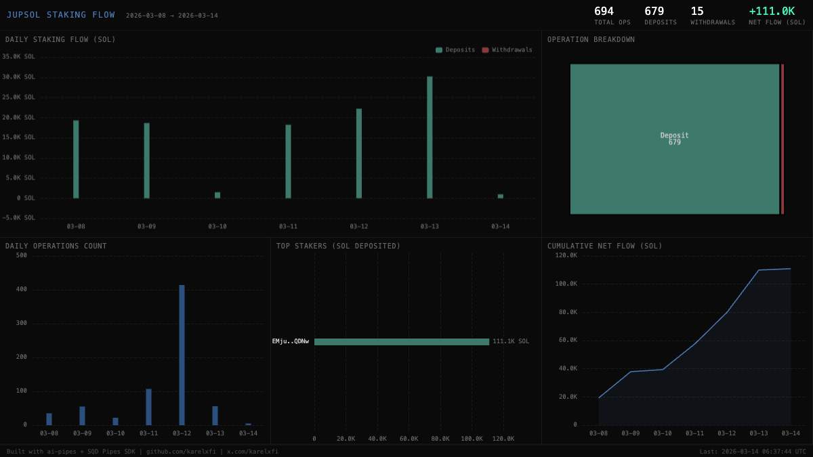

# Jupiter Staked SOL — jupSOL Staking Flow



## Verification Report

```
=== Jupiter Staked SOL Validator ===

Phase 1: Structural Checks
PASS: Table jupiter_staked_sol.staking_events exists
PASS: Row count: 694 (minimum: 50)
PASS: Schema has expected columns: slot, signature, event_type, amount, authority, timestamp
PASS: Event types valid: deposit=679, withdraw=15
PASS: Timestamps in range: 2026-03-08 to 2026-03-14
PASS: All amounts non-negative

Phase 2: Portal Cross-Reference
PASS: ClickHouse: 694, Portal: 698 (0.6% diff, within 5% tolerance)

Phase 3: Transaction Spot-Checks
PASS: Spot-check tx 1 — slot, event_type, authority match Portal data
PASS: Spot-check tx 2 — slot, event_type, authority match Portal data
PASS: Spot-check tx 3 — slot, event_type, amount match Portal data

Result: 10/10 checks passed
```

## Run

```bash
docker compose up -d && npm install && npm start
```

## Validate

```bash
npx tsx validate.ts
```

## Dashboard

Open `dashboard/index.html` in a browser.

## Sample Query

```sql
SELECT
    toDate(timestamp) AS day,
    event_type,
    count() AS events,
    sum(amount) / 1e9 AS total_sol
FROM jupiter_staked_sol.staking_events
GROUP BY day, event_type
ORDER BY day, event_type
```

Built with [ai-pipes](https://github.com/karelxfi/ai-pipes) + [SQD Pipes SDK](https://docs.sqd.dev/pipes)
