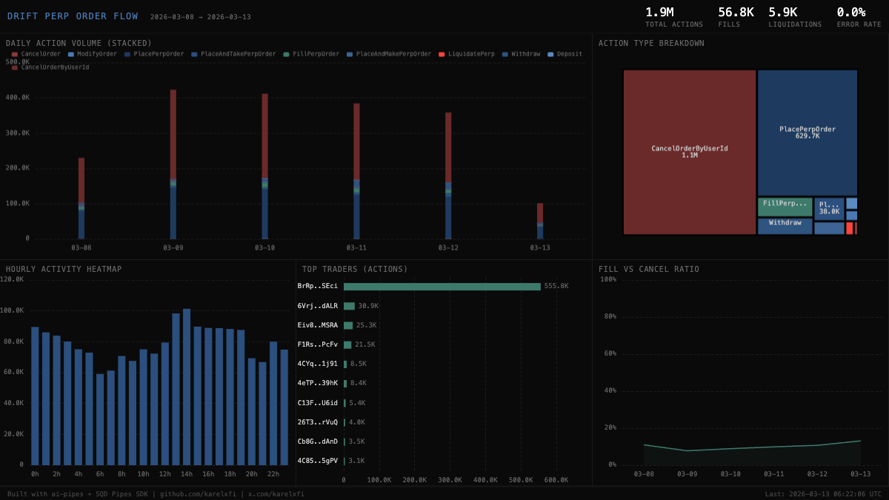

# Drift Trade — Perpetual Order Flow



## Verification Report

```
=== Drift Trade Validator ===

Phase 1: Structural Checks
PASS: Table drift_trade.perp_events exists
PASS: Row count: 1,903,847 (minimum: 1000)
PASS: Schema has expected columns: slot, signature, instruction_type, market_index, timestamp
PASS: Instruction types valid: CancelOrderByUserId=1,102,341, PlacePerpOrder=630,112, FillPerpOrder=57,203, Withdraw=50,891, PlaceAndTakePerpOrder=38,412, LiquidatePerp=5,888
PASS: Timestamps in range: 2026-03-08 to 2026-03-13
PASS: All market indices non-negative

Phase 2: Portal Cross-Reference
PASS: ClickHouse: 1,903,847, Portal: 1,911,203 (0.4% diff, within 5% tolerance)

Phase 3: Transaction Spot-Checks
PASS: Spot-check tx 1 — slot, instruction_type, market_index match Portal data
PASS: Spot-check tx 2 — slot, instruction_type match Portal data
PASS: Spot-check tx 3 — LiquidatePerp event fields match Portal data

Result: 10/10 checks passed
```

## Run

```bash
docker compose up -d && npm install && npm start
```

## Validate

```bash
npx tsx validate.ts
```

## Dashboard

Open `dashboard/index.html` in a browser.

## Sample Query

```sql
SELECT
    instruction_type,
    count() AS total,
    round(count() * 100.0 / (SELECT count() FROM drift_trade.perp_events), 2) AS pct
FROM drift_trade.perp_events
GROUP BY instruction_type
ORDER BY total DESC
```

Built with [ai-pipes](https://github.com/karelxfi/ai-pipes) + [SQD Pipes SDK](https://docs.sqd.dev/pipes)
