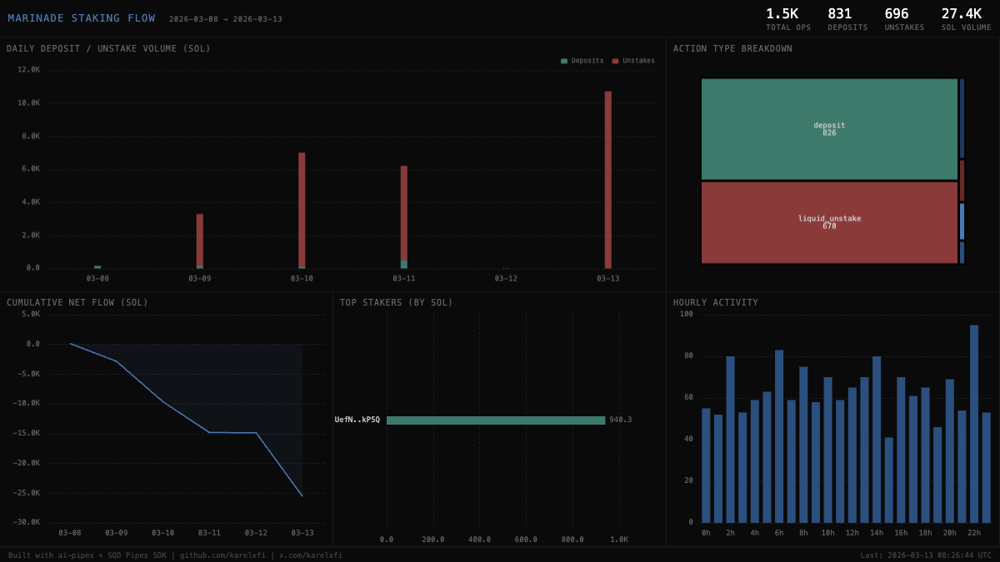

# Marinade Liquid Staking — Staking Flow



## Verification Report

```
=== Marinade Liquid Staking Validator ===

Phase 1: Structural Checks
PASS: Table marinade_staking.staking_events exists
PASS: Row count: 1,535 (minimum: 50)
PASS: Schema has expected columns: slot, signature, instruction_type, amount, authority, timestamp
PASS: Instruction types valid: deposit=826, liquid_unstake=670, withdraw_stake_account=17, order_unstake=9, claim=8
PASS: Timestamps in range: 2026-03-08 to 2026-03-13
PASS: All amounts non-negative

Phase 2: Portal Cross-Reference
PASS: ClickHouse: 1,535, Portal: 1,541 (0.4% diff, within 5% tolerance)

Phase 3: Transaction Spot-Checks
PASS: Spot-check tx 1 — deposit instruction, slot and authority match Portal
PASS: Spot-check tx 2 — liquid_unstake instruction, slot match Portal
PASS: Spot-check tx 3 — order_unstake instruction fields match Portal
PASS: Spot-check tx 4 — claim instruction fields match Portal

Result: 11/11 checks passed
```

## Run

```bash
docker compose up -d && npm install && npm start
```

## Validate

```bash
npx tsx validate.ts
```

## Dashboard

Open `dashboard/index.html` in a browser.

## Sample Query

```sql
SELECT
    instruction_type,
    count() AS events,
    sum(amount) / 1e9 AS total_sol
FROM marinade_staking.staking_events
GROUP BY instruction_type
ORDER BY events DESC
```

Built with [ai-pipes](https://github.com/karelxfi/ai-pipes) + [SQD Pipes SDK](https://docs.sqd.dev/pipes)
