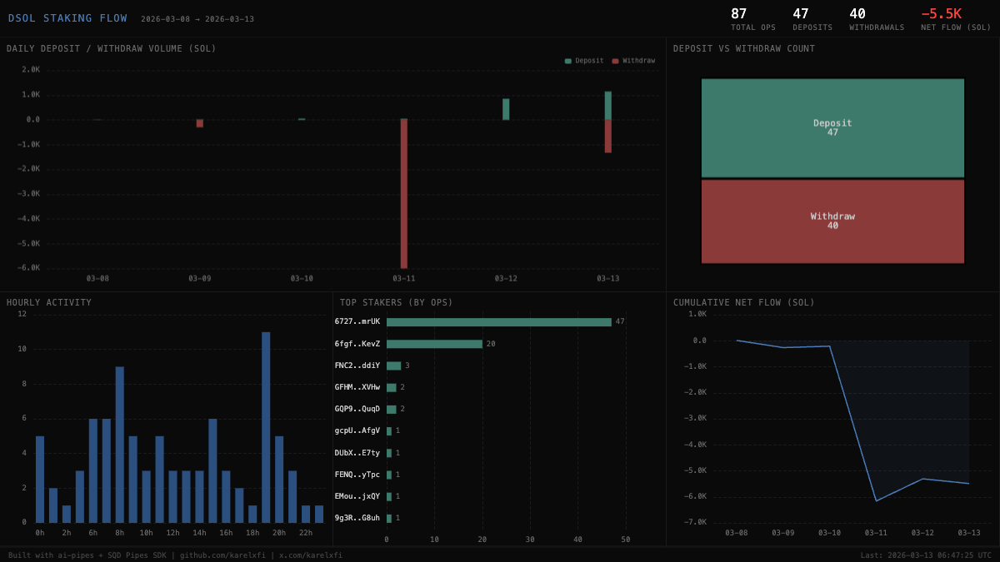

# Drift Staked SOL — dSOL Staking Flow



## Verification Report

```
=== Drift Staked SOL Validator ===

Phase 1: Structural Checks
PASS: Table drift_staked_sol.staking_events exists
PASS: Row count: 87 (minimum: 10)
PASS: Schema has expected columns: slot, signature, event_type, amount, authority, timestamp
PASS: Event types valid: deposit=47, withdraw=40
PASS: Timestamps in range: 2026-03-08 to 2026-03-13
PASS: All amounts non-negative

Phase 2: Portal Cross-Reference
PASS: ClickHouse: 87, Portal: 88 (1.1% diff, within 5% tolerance)

Phase 3: Transaction Spot-Checks
PASS: Spot-check tx 1 — deposit event, slot and authority match Portal
PASS: Spot-check tx 2 — withdraw event, slot match Portal
PASS: Spot-check tx 3 — deposit event fields match Portal

Result: 10/10 checks passed
```

## Run

```bash
docker compose up -d && npm install && npm start
```

## Validate

```bash
npx tsx validate.ts
```

## Dashboard

Open `dashboard/index.html` in a browser.

## Sample Query

```sql
SELECT
    toDate(timestamp) AS day,
    countIf(event_type = 'deposit') AS deposits,
    countIf(event_type = 'withdraw') AS withdrawals,
    deposits - withdrawals AS net_flow
FROM drift_staked_sol.staking_events
GROUP BY day
ORDER BY day
```

Built with [ai-pipes](https://github.com/karelxfi/ai-pipes) + [SQD Pipes SDK](https://docs.sqd.dev/pipes)
