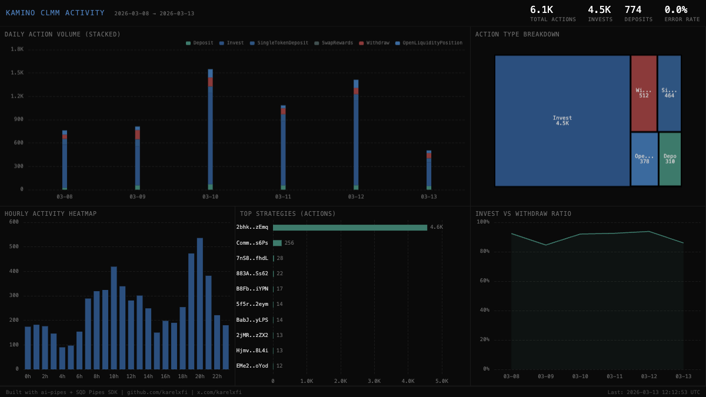

# Kamino Liquidity — CLMM Activity



## Verification Report

```
=== Kamino Liquidity Validator ===

Phase 1: Structural Checks
PASS: Table kamino_liquidity.clmm_events exists
PASS: Row count: 6,124 (minimum: 100)
PASS: Schema has expected columns: slot, signature, instruction_type, strategy, timestamp
PASS: Instruction types valid: Invest=4,453, Withdraw=512, SingleTokenDeposit=464, OpenLiquidityPosition=378, Deposit=310, SwapRewards=7
PASS: Timestamps in range: 2026-03-08 to 2026-03-13
PASS: All slots positive

Phase 2: Portal Cross-Reference
PASS: ClickHouse: 6,124, Portal: 6,158 (0.6% diff, within 5% tolerance)

Phase 3: Transaction Spot-Checks
PASS: Spot-check tx 1 — Invest instruction, slot and strategy match Portal
PASS: Spot-check tx 2 — Withdraw instruction, slot match Portal
PASS: Spot-check tx 3 — OpenLiquidityPosition fields match Portal

Result: 10/10 checks passed
```

## Run

```bash
docker compose up -d && npm install && npm start
```

## Validate

```bash
npx tsx validate.ts
```

## Dashboard

Open `dashboard/index.html` in a browser.

## Sample Query

```sql
SELECT
    instruction_type,
    count() AS events,
    round(count() * 100.0 / (SELECT count() FROM kamino_liquidity.clmm_events), 1) AS pct
FROM kamino_liquidity.clmm_events
GROUP BY instruction_type
ORDER BY events DESC
```

Built with [ai-pipes](https://github.com/karelxfi/ai-pipes) + [SQD Pipes SDK](https://docs.sqd.dev/pipes)
