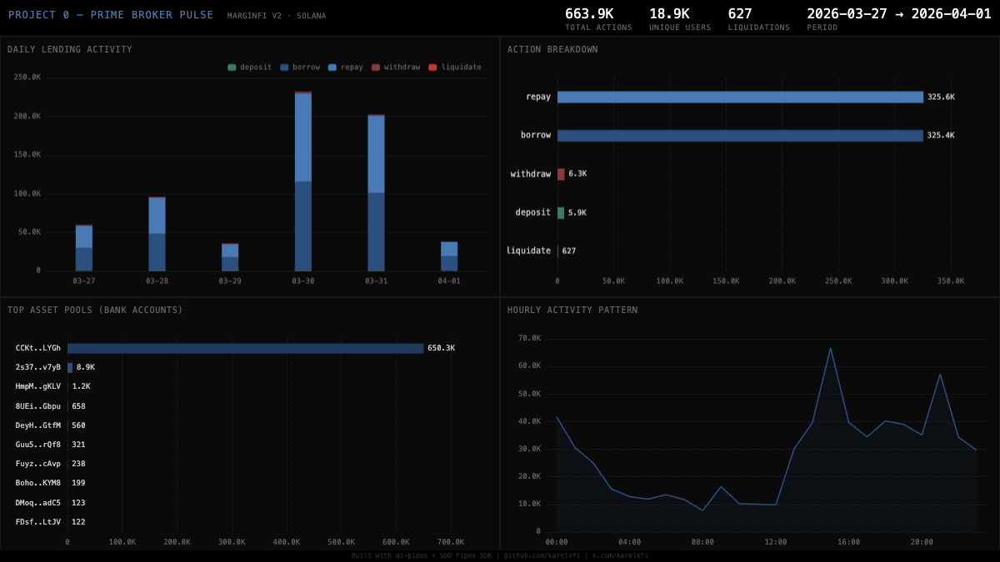

# Project 0 — Prime Broker Pulse



Indexes all lending activity on **Project 0** (prev. marginfi), Solana's first DeFi-native prime broker. Tracks deposits, withdrawals, borrows, repays, and liquidations across the marginfi-v2 program with bank account identification.

## Verification Report

```
=== Phase 1: Structural Checks ===
PASS: Structural - 663887 rows in project0_actions
PASS: Structural - schema OK (slot, timestamp, tx_signature, fee_payer, action, bank, sign)
PASS: Structural - action types: repay(325650), borrow(325392), withdraw(6293), deposit(5925), liquidate(627)
PASS: Structural - timestamps 2026-03-27 10:54:31.000 to 2026-04-01 05:08:39.000
PASS: Structural - slots 409192377 to 410243331
PASS: Structural - all rows have bank addresses

=== Phase 2: Portal Cross-Reference ===
PASS: Portal cross-ref - ClickHouse has data in sample range (109 rows)

=== Phase 3: Transaction Spot-Checks ===
PASS: Spot-check tx 2Uc8wi5iUL8Y... — slot 409192377, action repay, bank 2s37akK2..., payer MNGRcX4n...
PASS: Spot-check tx 4XTqfMkwWqWm... — slot 410243331, action borrow, bank HmpMfL89..., payer DnEi5hMJ...
PASS: Spot-check tx 5TGoG5TuabU5... — slot 410242924, action deposit, bank 2s37akK2..., payer 8yGDdaAB...

=== Phase 4: Data Quality ===
PASS: Data quality - borrow/repay ratio 1.00 is reasonable
PASS: Data quality - 18938 unique fee payers
PASS: Data quality - 68 unique bank accounts

=== Summary: 13 passed, 0 failed ===
```

## Run Instructions

```bash
# Start ClickHouse
docker compose up -d

# Install and run
npm install
npm start

# Validate
npx tsx validate.ts

# View dashboard
open dashboard/index.html
```

## Sample ClickHouse Query

```sql
-- Daily action counts
SELECT
  toDate(timestamp) AS day,
  action,
  count() AS cnt
FROM project0_lending.project0_actions
GROUP BY day, action
ORDER BY day, action

-- Top banks by activity
SELECT bank, count() AS cnt
FROM project0_lending.project0_actions
GROUP BY bank
ORDER BY cnt DESC
LIMIT 10
```
